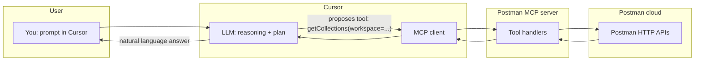
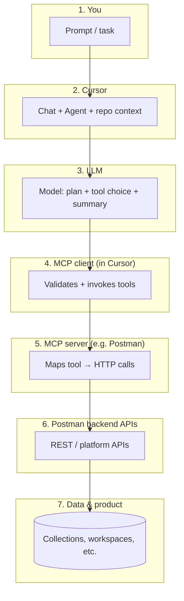
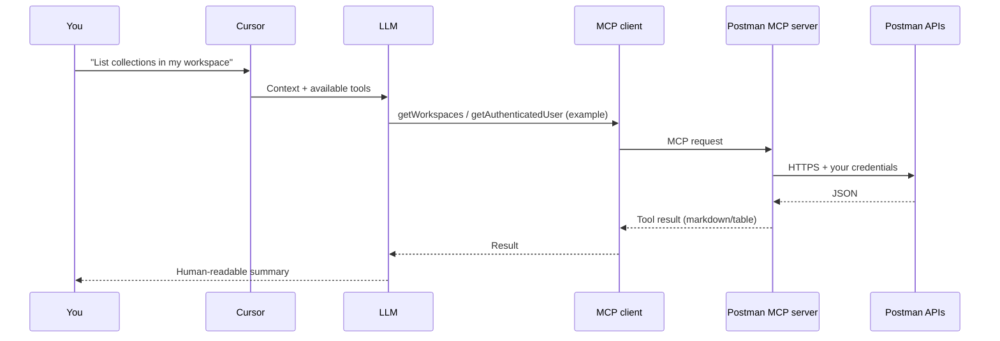
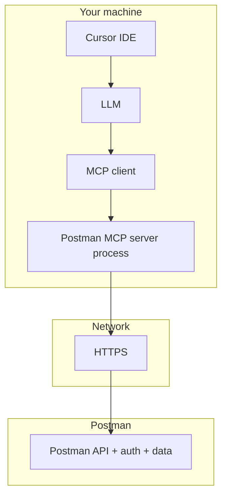

# Postman MCP, Cursor, and LLMs — End-to-End Guide

This document explains **what MCP is**, **why Postman provides an MCP server**, **how it connects to Cursor**, **where the LLM fits**, and **how far “MCP” reaches** in the stack (including what it does *not* cover). It is written for engineers who want a single mental model and reference diagram.

---

## 1. The one-line summary

- **MCP (Model Context Protocol)** is a **standard way** for an AI assistant to call **external tools** (APIs, databases, file systems) through a **small set of structured operations**, instead of the model guessing URLs and pasting curl by hand.
- **Cursor** is the **IDE + chat** that hosts the **LLM** and the **MCP client**, which talks to **MCP servers** you enable.
- **Postman’s MCP server** is a **bridge**: it exposes Postman’s **HTTP APIs** (collections, workspaces, environments, etc.) as **MCP tools** so the assistant can **list collections**, **read a collection**, **update requests**, and similar — **as authenticated you**.

---

## 2. What is MCP?

**MCP** is an **open protocol** (originally from Anthropic; now widely adopted) that defines:

| Concept | Meaning |
|--------|---------|
| **Host** | The application that runs the assistant (here: **Cursor**). |
| **Client** | Code inside the host that speaks MCP to servers (Cursor’s MCP layer). |
| **Server** | A process that **advertises tools** (and sometimes resources) and **executes** them when asked. |
| **Tool** | A named capability with a **JSON schema** for inputs, e.g. `getCollections`, `getWorkspaces`. |

The LLM does **not** talk HTTP to Postman directly. It **proposes** tool calls; the **MCP client** validates and sends them to the **MCP server**; the server **calls Postman’s backend APIs** with your token; results flow back as **structured text** for the model to summarize.

So **MCP is not “the Postman API”** — it is the **contract between Cursor’s assistant and a plugin (the MCP server)** that *implements* those tools using Postman (or anything else).

---

## 3. Why does Postman ship an MCP server?

Postman’s product is **API design, testing, and collaboration** in the cloud. Reasons to offer **MCP**:

1. **AI-native workflows** — Assistants in IDEs (Cursor, Claude Code, etc.) need **safe, scoped, authenticated** access to “my collections” and “my workspace” without copy-pasting API keys into every prompt.
2. **Stable tool surface** — Instead of every user inventing curl scripts, Postman exposes a **curated set of operations** that match how developers think: workspaces, collections, environments, mocks, specs.
3. **Alignment with where work happens** — Engineers already live in the editor; MCP brings **Postman operations into the same place** as code and docs.

Postman is **not** replacing the Postman app with MCP; it is **another client** of the same backend capabilities, optimized for **LLM tool use**.

---

## 4. What is Cursor’s role?

| Role | Description |
|------|-------------|
| **IDE** | You edit code, review diffs, run terminals — same as VS Code–family editors. |
| **Chat / Agent** | The **LLM** plans steps, reads files, and **invokes MCP tools** when the task needs Postman (or other servers). |
| **MCP host** | Cursor loads **MCP server configurations** (often from settings), starts or connects to servers, and passes **tool definitions** to the model so it knows *what* it can call. |
| **Orchestration** | Cursor decides **when** to call tools (user asks; agent mode), merges **repo context** + **tool results**, and keeps conversation state. |

Without Cursor (or another MCP-capable host), you would still have Postman’s HTTP API — but you would not have this **integrated “ask in natural language → structured tool calls”** loop in the editor.

---

## 5. Where does the LLM fit?

- The **LLM** turns your goal (“list collections in my workspace”) into **tool names + arguments**.
- The **LLM** does **not** need to know Postman’s full REST surface — only the **tool list** the MCP server exposes.
- **Accuracy** depends on: correct **auth**, valid **workspace IDs**, and **tool** behavior — the model can still misunderstand or pick the wrong tool; that is normal **human-in-the-loop** territory.

---

## 6. End-to-end architecture (layers)

Think of it as a **stack**. MCP is **not** the last hop to “everything Postman can do”; it is the **last standardized hop from the assistant to whatever the MCP server implements**.

**Important:** Anything **not** implemented as an MCP **tool** on that server is **not** reachable from the assistant via MCP — e.g. **closing unsaved tabs in the Postman desktop app** is **UI state**, not Postman’s public API, so it will not appear here.

---

## 7. Connection flow: “How did we connect Cursor to Postman?”

Exact UI paths change with Cursor versions, but the **logical** steps are:

1. **Authentication** — Postman MCP needs a way to act **as you** (API key, OAuth, or whatever the server documents). Without this, tools return auth errors.
2. **Register the MCP server in Cursor** — In Cursor settings, you add an MCP server entry (command to run the server, or hosted endpoint, plus env vars for secrets).
3. **Cursor discovers tools** — On connect, the server publishes **tool names + JSON schemas**.
4. **You ask in chat** — The model uses those tools when relevant.

---

## 8. Is MCP the “last point,” or is there more after it?

| Question | Answer |
|----------|--------|
| Is MCP the **last** thing in the whole world of Postman? | **No.** It is the **last protocol hop between Cursor’s assistant and the Postman MCP process**. After that, the MCP server still calls **Postman’s HTTP APIs**, which talk to **databases and services** inside Postman’s infrastructure. |
| Can more be added **after** MCP? | **Yes, in two directions:** (1) **More tools** on the same Postman MCP server (new operations Postman exposes). (2) **Other MCP servers** in Cursor (GitHub, Slack, internal APIs) — each is another endpoint in the same assistant loop. |
| Is MCP the **only** way to automate Postman? | **No.** You can always use Postman’s **HTTP API**, **CLI**, **Newman**, or the **app UI** directly. MCP is for **LLM-shaped** automation inside **MCP hosts**. |

So: **MCP is not the final layer of “all software”** — it is a **narrow, stable interface for AI tools**, with **Postman’s cloud API** (and its own limits) behind it.

---

## 9. Limitations (what this setup does *not* do)

These are useful to document for stakeholders so expectations stay realistic:

| Area | Typical limitation |
|------|-------------------|
| **Postman Desktop UI** | Open tabs, unsaved local edits, window layout — **not** exposed via MCP / public API the same way. |
| **Tool coverage** | Only what the MCP server **implements**; not every Postman feature is a tool. |
| **LLM errors** | Wrong tool, wrong `workspace` id, or hallucination before tool call — **you** verify critical changes. |
| **Security** | The MCP server runs with **your** Postman credentials; treat server config and tokens like production secrets. |

---

## 10. Mental model in one diagram

---

## 11. Glossary

| Term | Short definition |
|------|------------------|
| **MCP** | Protocol for **tools + resources** between an AI host and plugins (servers). |
| **MCP server** | Process that **implements** tools (e.g. wraps Postman APIs). |
| **Cursor** | Editor that **hosts** the LLM and MCP **client**. |
| **LLM** | Model that **reasons** and **selects tools**; does not replace API security or business rules. |
| **Postman API** | HTTP interface to Postman’s cloud; the MCP server **uses** it under the hood. |

---

## 12. Related reading

- **Model Context Protocol** — Official specification and ecosystem (search for “Model Context Protocol documentation”).
- **Cursor MCP docs** — How to configure MCP servers in Cursor (settings differ by release; prefer Cursor’s own docs for the latest UI).

---

*This doc was written for internal/architecture explanation. Update the “Connection flow” section if your team uses a specific auth method or hosted MCP endpoint.*
